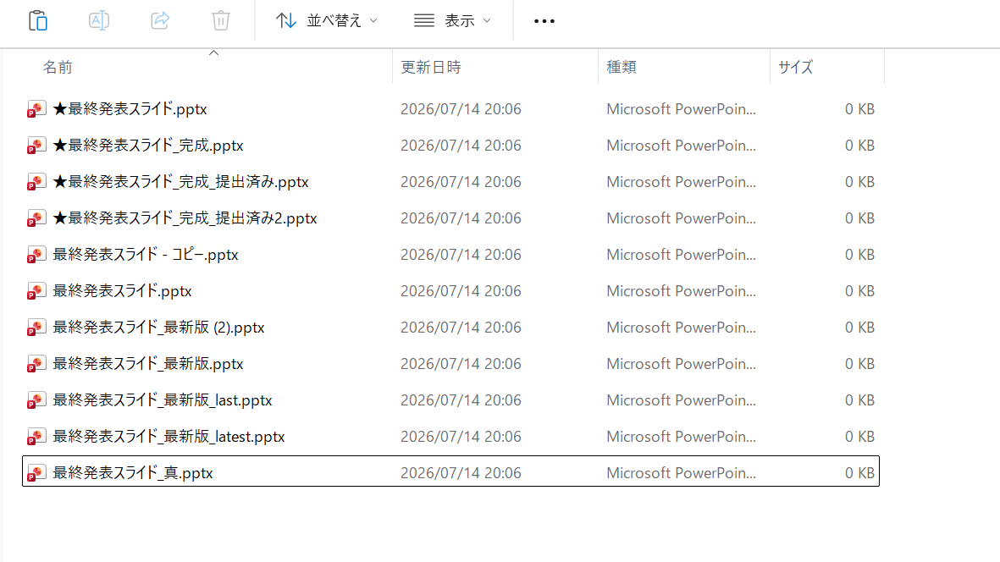

# Git/GitHub講習会
### 2026.07.22　講師: 寺田侑史（大学1年）

---

## おしながき

1. バージョン管理の必要性を知ろう
2. Gitとは
3. GitHubとは
4. `local`と`remote`
5. Gitの基本用語
6. 実際に使ってみよう

---

# 1. バージョン管理の必要性を知ろう

---

こんな経験、ありませんか？

---

......ありますよね？

---

逆に、こんなこともありますよね...？

> 平社員「よし、明日の発表スライドできた！保存してから閉じてっと」
> 課長「君、ちょっといい？」
> 平社員「はい、どうしましたか？」
> 課長「前に削除してって言ったスライドあるじゃん？」
> 平社員「ありましたね。」
> 課長「やっぱあのページ欲しいから修正よろしくね。」
> 平社員「くぁｗせｄｒｆｔｇｙふじこｌｐ」

---

なぜこのようなことになってしまうのか？
— それはひとえに、**バージョン管理能力のなさ**です。

複数のバージョンがあるファイルを人間が管理することはほぼ不可能でしょう。

---

......では、どうすれば？

---

---

ではここで**バージョン管理に必要な条件**を考えてみましょう。

---

## **バージョン管理の必要条件3つ**

- 元に**戻せる**
  - 平社員もニッコリ！
- **比較**できる
  - もうこれでファイルの名前には困らない！
- 上の2操作を**安全に**行える
  - 恐る恐るアプリケーションを閉じなくていい！

### この3つをすべて兼ね備えているのが`Git`です。

---

# 2. Gitとは

---

### Gitとは、**バージョン管理を行うソフトウェア**です。

例えば

`ver1→ver2→ver3→ver4`

という履歴を全部保存してくれます。

さらに
- 新しい機能を実働環境に影響なく実験する
- バグを修正する
といったことを別ルート（`branch`）で進められます。

---

# 3. GitHubとは

---

### Gitで管理しているデータを置く**クラウドサービス**です。

- 開発データのバックアップ
- チーム開発のプラットフォーム
- コードの共有
- `Issue`や`PR`（`Pull Request`）の管理

> `Git`＝エンジン
> `GitHub`＝Gitを便利に使うサービス
> というイメージかなぁ...。

---

# 4. `local`と`remote`

---

### Gitの大事な考え方 = `local`と`remote`

##### `local`
- 自分のPC上にある作業場所
- teradaにはteradaの`local`があり、abeにはabeの`local`が存在する

##### `remote`
- インターネット上にある共有場所
- GitHubが`remote`にあたる （GitHubを使う場合）

---

# 5. Gitの基本用語

---

## 基本用語一覧

- Repository（レポジトリ/リポジトリ）
- Clone（クローン）
- Commit（コミット）
- Push（プッシュ）
- Pull（プル）
- Branch（ブランチ）
- Merge（マージ）
- Conflict（コンフリクト）
- Resolve（リゾルブ）

---

## 参考資料
- [完全初心者向けGit用語集 | Qiita](https://qiita.com/shinshingodmt/items/637cf9e5c6660509c460)
- [Git 基本の用語集 | Qiita](https://qiita.com/toshi_um/items/72c9d929a600323b2e77)
- [【Git・GitHub】用語のまとめ](https://zenn.dev/miya_akari/articles/13c718afa783fe)

> いろいろ自分で調べてみてね

---

# 6. 実際に使ってみよう

---

## 実習のおしながき

1. 既存のリポジトリをクローンしてみよう
2. ブランチを切ってみよう
3. ファイルを変更してコミットしてみよう
4. プッシュしてみよう
5. マージしてみよう
6. コンフリクトを起こしてリゾルブしよう
7. GitHubの便利機能を使ってみよう

---

ここからは講師のPC画面を見てください。

---

